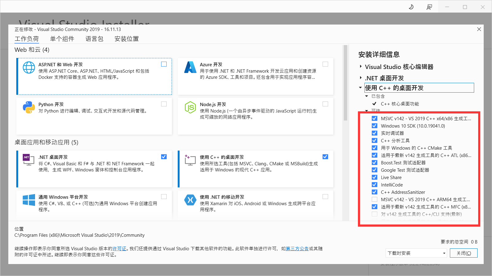
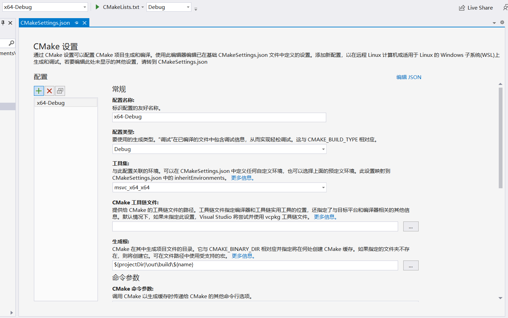
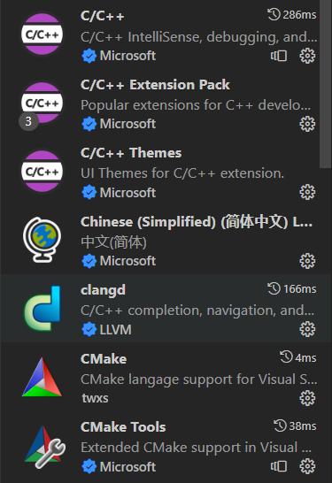

# 准备环境

## 写在前面

在Windows上进行Qt开发，可以选择下面任何一款IDE
+ Visual Studio（不需要任何配置）
+ Clion（几乎不需要任何配置）
+ Qt Creator（需要初始化编译器和LLVM）
+ VSCode（需要下载CMake、Clangd插件，编写settings.json）

### 注意事项

+ 除了Qt Creator以外，其他所有非官方IDE都无法使用图形界面给工程添加资源条目，因此Qt Creator是必须安装的，在需要改动资源时用QtCreator打开`qrc`文件单独修改
+ 只有Qt Creator和VS支持qmake项目，不过本工程是CMake项目，所以都可以

## 工具集合

### 自己安装

+ Microsoft VC++ 编译器
+ Qt 5.15.2 开发套件
+ LLVM 静态分析工具（使用Qt Creator或VSCode时需要安装）

### Qt Creator/Visual Studio自带

+ CMake
+ Ninja Build

在Qt与MSVC装完以后，它们各自都会带一份自己的CMake和Ninja，选择其中一个，将它们所在路径添加到系统环境变量中。

## 工具安装

### 编译器

#### MSVC

+ 在Windows中，在Visual Studio Installer中增加`使用C++的桌面开发`模块，添加如下组件，建议都选，ATL与MFC可以不选。



#### Clang

+ 在Mac中，一般自带。

#### GCC

+ 在Linux中，使用`apt install build-essential`安装GNU编译套件。

### Qt

+ 下载链接：https://download.qt.io/official_releases/online_installers/
    + 需要先注册账号，同意所有协议，选择个人开发者
    + Windows/Mac/Linux都需要在这里下载，最好不要用包管理器安装

+ 参考教程：https://blog.csdn.net/Qi_1337/article/details/121249717

+ 版本选择：5.15.2

+ 安装组件：
    + Preview
    + Qt 5.15.2
        + MSVC 2019 32-bit
        + MSVC 2019 64-bit
        + Sources（源码，便于调试与造控件，如果嫌太大可以不要）
        + Qt Debug Information Files（调试文件）
    + Developer and Designer Tools
        + Qt Creator
        + Debugging Tools
        + Qt Creator Debug Symbols
        + Qt Creator Plugin Development
        + Qt Design Studio（设计器，有需要可以下）
        + CMake
        + Ninja

MinGW是另一个编译套件，可以选，但本工程大概率不会用到。

+ Windows中，需要将Qt库所在目录加入系统Path环境变量（这步非常重要）
    + 如果安装在C盘，那么应该是这个
        + `C:\Qt\5.15.2\msvc2019_64\bin`

### LLVM

+ 下载地址：https://github.com/llvm/llvm-project/releases
    + Windows安装时建议同意添加路径到系统环境变量
    + Linux中可使用`apt install llvm clangd`

+ 重要组件：
    + clang-format：代码格式化工具
    + clangd：代码补全、静态分析服务器，需要构建工具提供`compile_commands.json`

### CMake

+ 下载地址：https://cmake.org/files
    + 推荐版本3.24及以上，在Linux中不推荐使用`apt`安装（版本只有3.16）

+ 添加环境变量
    + 将`cmake`命令所在目录添加到环境变量即可

+ Linux快速安装命令
    ```sh
    # 下载、解压、安装
    wget https://cmake.org/files/v3.25/cmake-3.25.0-rc2-linux-x86_64.tar.gz
    tar -C /usr/local -xzf cmake-3.25.0-rc2-linux-x86_64.tar.gz
    mv /usr/local/cmake-3.25.0-rc2-linux-x86_64 /usr/local/cmake
    rm -rf cmake-3.25.0-rc2-linux-x86_64.tar.gz

    # 配置环境变量
    echo "export PATH=\$PATH:/usr/local/cmake/bin" >> ~/.bashrc
    source ~/.bashrc
    ````

### Ninja

+ Windows中因为Visual Studio套件自带，不需要额外安装

+ Mac中一般直接使用Qt Creator，也是自带，不需要额外安装

+ Linux中没有自带Ninja工具，需要自己安装
    ```sh
    sudo apt install ninja-build
    ````


## 平台相关配置

### Windows

+ VS的cmake插件在类似下面路径
    + `C:\Program Files (x86)\Microsoft Visual Studio\2019\Community\Common7\IDE\CommonExtensions\Microsoft\CMake\CMake\bin\cmake.exe`
    + 也可以直接使用这个CMake，将其添加到环境变量即可

### Mac

+ 在 macOS 平台编译时，如果因为使用homebrew安装Qt等原因导致产生了诸如`Could not find a package configuration file provided by "Qt5" with any of the following names:...`之类的错误，请在configure前提供如下环境变量以使CMake能找到Qt库的位置（请视情况自行根据安装Qt库的位置改变命令中的路径）：
   ```sh
   export QT_DIR=/opt/homebrew/opt/qt@5
   export Qt5_DIR=/opt/homebrew/opt/qt@5
   ```

### Linux

+ 安装必要的库
    ```sh
    sudo apt install curl mesa-common-dev libgtk-3-dev libxext-dev libasound2-dev libpulse-dev python3 python3-pip
    ````

## 本工程的配置

### 工程说明

+ 本工程使用CMake构建系统，在Windows上默认使用MSVC 2019 64bit进行开发（如果下载Visual Studio 2022则使用MSVC 2022 64bit），Mac默认使用Clang 64，Linux使用GCC 64。


### 使用vcpkg下载并预构建依赖库

+ 找到Qt安装目录（此目录中包含Qt5Config.cmake）
    + Windows中一般是`C:\Qt\5.15.2\msvc2019\lib\cmake\Qt5`

+ 修改vcpkg的自定义`triplet`参数
    + 打开`scripts/vcpkg/triplets/paths/path_qt.cmake`
    + 修改`_qt_dir`的右值为你的Qt安装目录

+ 在仓库根目录执行`python setup-vcpkg.py`，此脚本简单地从GitHub中拉取`vcpkg`并执行一系列`vcpkg install`命令。

+ 可使用`git update-index --no-skip-worktree <file>`在不删除的前提下取消对`path_qt.cmake`的跟踪。

<!-- ### 准备FFmpeg库

+ 下载地址：https://github.com/SineStriker/binary-res
    + 将`bin`、`include`、`lib`、`share`目录直接复制到`pkg/src/FFmpeg/usr`中。
+ 由于需要自己编译FFmpeg，过于复杂建议直接复制粘贴。

### 构建Pre-Built库

+ 在开始菜单搜索`x64 Native Tools Command Prompt for VS 2019`（也可能是2022），它会配置好MSVC编译器的一系列环境变量给此终端上下文。

+ 切换到`pkg`目录
````
cd pkg
````

+ 执行CMake Configure
````
cmake --no-warn-unused-cli -DCMAKE_EXPORT_COMPILE_COMMANDS:BOOL=TRUE -DCMAKE_BUILD_TYPE:STRING=Release -S. -Bbuild -G Ninja
````

+ 执行CMake Build
````
cmake --build build --target all
````

+ 执行CMake Install
````
cmake --build build --target install
````

+ 这些库也可以放在工程里一起参与构建，但是可能会带来不必要的编译任务，所以提前全部编译好。Ninja是用来引入并行化加速构建过程的，因此Build过程可能出错，重新执行Build命令即可。

+ 此外，由于一些库Debug版本与Release版本是不兼容的，还需要构建一份Debug版本的，在CMake Configure中把参数`-DCMAKE_BUILD_TYPE:STRING=Release`改为`-DCMAKE_BUILD_TYPE:STRING=Debug`，然后再次执行三次命令，CMake有热更新机制不用执行Clean。 -->

### 打开工程

#### Qt Creator

+ 配置Clang-Format
    + 打开Qt Creator
    + 帮助-关于插件-C++
    + 打开Beautifier
    + 重启Qt Creator
    + 工具-选项（或者编辑-首选项）-Beautifier-Clang Format
    + 修改ClangForamtCommand为`LLVM安装路径\bin\clang-format.exe`
        + 如果LLVM安装路径已在系统环境变量中，可直接填`clang-format`
    + 环境-键盘
    + 命令ClangFormat-FormatFile，快捷键自定义，我用的`Ctrl+Alt+L`
    + 确定保存即可

+ 打开`src/CMakeLists.txt`（不要打开仓库根目录），Windows中选择编译器为64位MSVC，构建目录放在上一层。


#### Visual Studio

+ 直接打开仓库目录，VS会自动检测CMake工程，添加配置可以点击上方`x64-Debug`下拉选择管理配置；



+ 可以为本项目添加x64-Release目标
+ 关于单个目标构建：由于插件目标与主目标没有隐式依赖关系，而VS又是不支持同时构建所有目标的，所以如果更改了插件，那么请先构建插件目标，比如`NativeWindow.dll`，如果不构建此插件，那么`LabelVoice`会找不到无边框窗体插件而使用系统边框。
+ 每次构建建议不要点工具栏单个构建，应该执行`菜单栏-生成-全部生成`。

#### Clion

+ 将Visual Studio设为默认工具链，架构选择amd64
+ 直接打开仓库目录，Clion会自动检测CMake工程；
+ 使用Clion默认不带Ninja构建，如想使用请自行添加编译参数`-G Ninja`
    + 较早版本的Clion如果使用`Ninja`重载掉默认参数后，似乎会导致忽略默认编译器信息，如果你的电脑安装了MinGW就会变成MinGW，如想使用MSVC需要显式指定编译器，因此建议升级最新版本。
    + https://youtrack.jetbrains.com/issue/CPP-17735
+ 每次构建选择`Main Menu-Build-Build All`，可将`Build All`这个项添加到`Main Toolbar-Toolbar Run Actions`。

#### Visual Studio Code

+ 安装C/C++ Extension Pack（包含CMake）、Clangd扩展



+ 默认重排代码快捷键为`Ctrl+Shift+I(Linux)`/`Alt+Shift+F(Windows)`，可以手动改成JetBrains风格的`Ctrl+Alt+L`；
+ 编辑`.vscode/settings.json`
    ```json
    {
        "cmake.generator": "Ninja",
        "cmake.configureOnOpen": false,
        "cmake.configureOnEdit": false,
        "clangd.arguments": [
            "--header-insertion=never",
            "--function-arg-placeholders=false",
            "--clang-tidy"
        ],
        "C_Cpp.intelliSenseEngine": "Disabled",
        "editor.gotoLocation.alternativeDefinitionCommand": "editor.action.revealDeclaration",
        // "cmake.copyCompileCommands": "build",
        // "clangd.path": "C:\\Program Files\\LLVM\\bin\\clangd.exe",
    }
    ````
    + 设定生成器为`Ninja`
    + 设置启动时或改动后不自动执行`CMake Confiugre`
    + 设置Clangd不自动添加头文件，函数不自动填充
    + 关闭`C/C++ IntelliSense`引擎
    + 设置`Ctrl`单击函数时，自动转到声明
    + 设置CMake输出`compile_commands.json`到`build`目录（已注释，Windows似乎不需要）
    + 设置Clangd文件路径（已注释，如果不在系统环境变量中需要启用）

+ `Ctrl+Shift+P`打开命令选择器，下面这些命令很常用
    + `CMake Configure`：配置项目
    + `CMake Build`：构建项目（下方Build按钮也可以）
    + `CMake Clean`：清理项目

+ 直接打开仓库目录，执行`CMake Configure`，编译工具链选择`Visual Studio - amd64`。

## 软件发布

### 构建目标

+ 本软件的非共享代码一共构建两种目标
    + 动态库
        + QuCore
        + QuElem
        + QuStaging
    + 可执行
        + QSynthesis

+ `QuCore`与`QuElem`是本软件的基础部分，用来给插件调用。

+ `QuStaging`是本软件的核心部分，仅导出一个与`main`函数结构完全一样的函数，用来给`QSynthesis`调用，其他函数和类对外均不可见。

+ 可执行文件`QSynthesis`充当一个加载器。

### 程序相关目录

1. 操作系统、Qt相关目录
    + lib
    + plugins
+ 目录`plugins`是Qt插件系统的检索目录，在`QApplication`实例化时使用`addLibraryPath`设定。
+ 目录`lib`是程序会用到的其他动态库集中放置的路径。在Linux下，链接器默认会将此目录名设为动态库的检索路径；在Windows下，`QSynthesis`在入口点会调用`SetDllDirectoryW`将此目录加入动态库搜索路径集合；在Mac下，此目录不必存在。

2. 软件相关目录
    + resources/modules
    + resources/plugins

+ 由于QsLib与QSynthesis的插件也基于Qt插件系统，但需要与Qt官方发插件独立放置，因此放置于`resources`目录下。`modules`中放置QsLib的插件，`plugins`中放置QSynthesis的插件。

### 开发模式

+ `Config.cmake`中`APP_DEPLOY`变量设为关闭。

+ 在Windows下，`QSynthesis`由操作系统自动链接`QsStaging`，因此两个目标文件必须在同一目录。在开发状态下，两者在同一目录对于依赖关系比较友好。

### 发布模式

+ `Config.cmake`中`APP_DEPLOY`变量设为开启。

+ 在Windows下，`QSynthesis`在运行期显式加载`QsStaging`动态库。`QSynthesis`固定从`lib`目录寻找`QsStaging`，`QsStaging`构建后也会输出在`lib`目录。

## 其他

+ 在Linux和Mac下，不管是开发模式还是发布模式，`QSynthesis`均在编译期直接动态链接`QsStaging`。

+ 在Linux和Windows下，不管是开发模式还是发布模式，构建时会将除了Qt以外的外部库都复制一份到构建目录中。

+ 之所以要分成这两部分，主要是为了在Windows中能够把大部分动态库放置在`lib`目录中来保持根目录的简洁，这样的根目录结构也与Linux保持了统一。

+ 在发布模式下，您可以直接构建目标`deploy`（这个目标在开发模式是没有的），CMake会自动完成所有构建工作并将完整的发布版本输出在`CMAKE_BINARY_DIR`中。由于发布模式下各目标之间的依赖关系过于复杂不适合热加载，因此不应当反复修改源文件再中途构建。