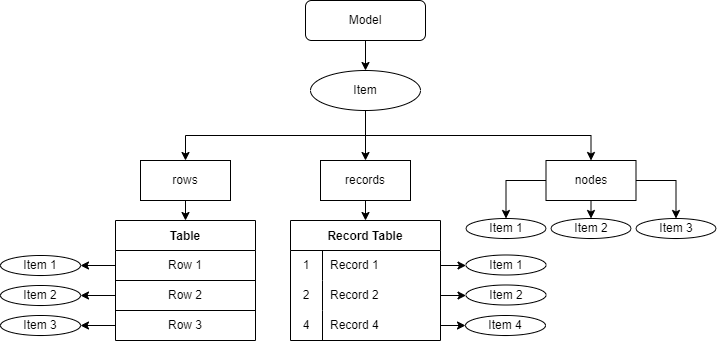

# AceTreeModel

---

## 简介

`AceTreeModel`是为 ChorusKit 设计的文档模型，它相当于一个树型的内存数据库。

之所以没有使用`QAbstractItemModel`，是因为它只能使用行列索引元素，并且查找、删除、插入都是线性复杂度，对于音符、控制点这类顺序关系复杂、数量多的图形元素，处理效率特别低。

## 特性

`AceTreeModel`维护一颗具有事务属性的树，它会记录与它关联的所有结点的更改，支持以日志的形式将状态持久化在文件系统中。因此，如果应用程序发生异常退出（或者系统发生断电），通过日志可以将所有状态恢复。

### 多种节点存储方式

`AceTreeItem`是`AceTreeModel`的节点数据结构，它支持同时维护三组子节点（线性表、自增主键表、集合）。



+ 线性表（Vector - Rows）
    + 适合存储数量不太多、顺序关系明确、不存储自身索引的元素
    + 对应于有序`JsonArray`
    + 父节点以连续数组的形式维护线性表中子节点的顺序关系
        + 插入/删除：O(n)
        + 追加：O(1)
        + 查找索引：O(n)
        + 索引访问：O(1)

+ 自增主键表（RecordTable - Records）
    + 适合存储数量多、没有顺序关系、存储自身索引的元素
    + 对应于无序`JsonArray`
    + 父节点按照插入顺序为每个子节点分配自增ID，已删除的元素的ID不会再次出现
        + 插入/删除：O(1)
        + 查找 ID：O(1)
        + ID 访问：O(1)
+ 集合（Set -Nodes）
    + 适合存储数量固定、没有顺序关系的元素
    + 对应于`JsonObject`
    + 父节点仅维护子节点的指针集合
        + 插入/删除：O(1)
        + 查找：O(1)
        + 名字访问：O(1)

### 节点属性

`AceTreeItem`除了子节点以外，也维护了一些与自身关联的数据结构。

+ 属性表
    + 字符串到任意类型的哈希表，操作均为常数时间

+ 动态数据表
    + 字符串到任意类型的哈希表，操作均为常数时间

+ 字节数组
    + 可存储二进制数据，提供增、删、替换、查找等操作

### 节点所有权

一般的历史记录框架，在对插入/删除操作进行撤销/重做时，会将变更的实例进行序列化/反序列化，这样会比较低效。在`AceTreeModel`的实现方式中，为了使事务机制更高效，我们为`AceTreeItem`引入了所有权的概念。

起初，`model`是空的，它甚至没有根节点。用户需要使用`new`操作符创建一个`item`，并对其进行修改或添加子节点。

+ 例子

    ```c++
    auto model = new AceTreeModel(); // Empty model

    auto rootItem = new AceTreeItem("root");
    auto childItem = new AceTreeItem("child");
    auto tempItem = new AceTreeItem("temp");
    auto grandItem = new AceTreeItem("grandson");

    rootItem->setAttribute("name", "foo");   // Op1
    rootItem->appendRow(childItem);          // Op2
    rootItem->appendRow(tempItem);           // Op3
    rootItem->removeRow(tempItem);           // Op4
    ```
    + 首先我们创建了一些`item`，对`rootItem`进行了设置属性、添加子节点、删除子节点的操作，此时`childItem`是其子节点，而`tempItem`被我们添加了以后又移除了，此时
        + `rootItem`没有父节点，所有权属于用户
        + `childItem`的父节点是`rootItem`，所有权属于`rootItem`
        + `tempItem`在`Op3`后所有权属于`rootItem`，在`Op4`后所有权属于用户
    + 结论：
        + 在不与模型发生任何关联时，一个`item`如果有父节点，那么其所有权属于父节点，否则所有权属于用户
        + 所有权属于用户的`item`，如果不使用需要用户删除，否则会引起内存泄漏
        + 用户删除`item`后，其所有子节点都会递归删除
        + 用户删除一个有父节点的`item`，会自动与其父节点解除关系（不推荐这么做）

    ```c++
    model->setRootItem(rootItem);            // Op5
    rootItem->setAttribute("name", "bar");   // Op6
    childItem->setAttribute("num", 1);       // Op7
    grandItem->setAttribute("name", "baz");  // Op8
    childItem->addRecord(grandItem);         // Op9
    grandItem->setAttribute("name", "hack"); // Op10
    rootItem->removeRow(child);              // Op11
    ```
    + `Op5`将`rootItem`设为了`model`的根节点，从此时开始，`rootItem`以及`rootItem`的所有子孙节点的所有权不再属于用户，全部转移给了`model`，上述节点中
        + `tempItem`的所有权属于用户，因为它已经从`childItem`被删除了
        + `grandItem`的所有权属于用户
    + `Op6`、`Op7`两步对`rootItem`与`childItem`进行了改动，这两步会被`model`记录
    + `Op8`改动了`grandItem`，由于`grandItem`此时还不属于`model`，因此其改动不会记录
    + `Op9`将`grandItem`添加给了`childItem`，此时`grandItem`的所有权也属于`model`了，并且这一步也会被记录
    + `Op10`改动了`grandItem`，这一步会被记录
    + `Op11`从`rootItem`中移除了`childItem`，此时`childItem`的所有权还是属于`model`，并且它已经被标记为废弃状态，用户不应对其进行任何写操作
    + 结论：
        + 一个`item`一旦被设置为`model`的根节点，或者被插入到了任何一个属于`model`的节点，它本身以及它的所有子孙节点的所有权都将转移给`model`
        + 一个`item`的所有权一旦转移给了`model`，即使将它从它的父节点移除，其所有权依然属于`model`，并且从移除时起它会被`model`标记为废弃状态，虽然还能进行只读访问，但是用户应该将它视为已被删除的节点
        + 一个`item`如果属于`model`，那么对它的操作都会被记录（包括修改属性、添加子节点等），并且用户不能将它插入到其他的`item`中或设为其他`model`的根节点

## 历史记录机制

### 操作类型

在所有权属于`model`的节点上进行以下操作，会被记录
+ setProperty/setAttribute（设置属性）

+ setBytes（覆写字节）
+ insertBytes（插入字节）
+ removeBytes（删除字节）

+ insertRows（插入线性表元素）
+ removeRows（删除线性表元素）
+ addRecord（添加自增主键表记录）
+ removeRecord（删除自增主键表记录）
+ addNode（添加集合元素）
+ removeNode（删除集合元素）

以下操作不会被记录
+ setDynamicData

### 撤销重做框架

在执行一次会被记录的操作后，`model`内部维护的步数将会自增一次，可通过`currentStep`获取步数。

在`model`中使用`remove`方法删除的节点并不会立刻从内存中被删除，而是会被标记为废弃状态，仍然被`model`维护着。

在增加新的操作前，用户可以通过`setCurrentStep`将`model`设置到任何到达过的状态。如果第 N 步移除了一些节点，那后又执行了一些操作到了第 N+M 步，此时被删除的节点还留在内存中（只是被标记为废弃状态），如果调用`setCurrentStep`回到第 N-1 步，那么被删除的节点就会恢复为正常状态，依然可写。

如果第 N 步添加了一些节点，然后撤销到第 N-5 步，那么第 N 步添加的节点就会被标记为废弃状态被`model`维护起来。然后执行一步新的操作到了第 N-4 步，这些节点才会真正从内存中被删除，因为再也不可能回到原来的第 N 步了。

### 异常恢复

可使用`startLogging`为`model`设置一个用来存储日志的文件流。

+ 日志为二进制形式，头部留有两个`int32`的位置标记当前步数与总步数
+ 每次撤销或重做会更新当前步数
+ 每次新操作发生时，会截断当前步数的日志片段的尾部之后所有的内容，追加新操作的日志片段，并更新总步数